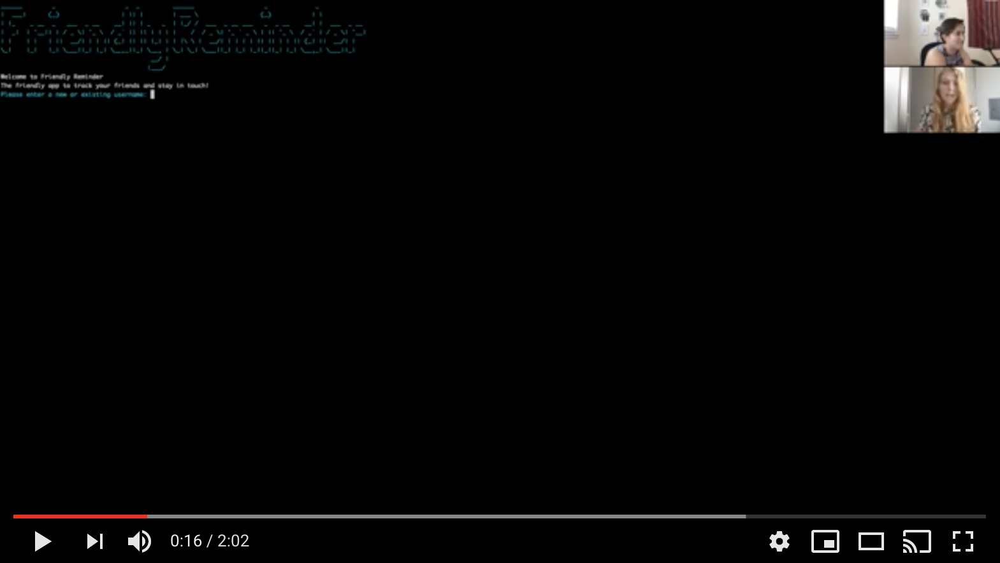

# Friendly Reminder

Staying in touch with your friends and colleagues is no easy task, and right now it's more important than ever to maintain those relationships.
Even with the best intentions at heart, time can pass by quickly, leaving weeks or even months since you last contacted your friend.
You can improve your relationships and hold yourself accountable by simply keeping track of who is in your network and when you spoke last.

Sometimes...you just need a friendly reminder.

## Information and Features

Friendly Reminder is a CLI application that allows users to track and maintain their relationships.

### Users can log on with a new or existing username and proceed to the main menu.

Add New Conversation with Friend

-The user can begin by adding a new conversation. 
-The user inputs the name of their friend and the date of their last connection.
-The app will create a new "friend" instance which they can view in their friend list at any later time.

Delete Conversation with Friend

-Not all friendships were meant to last forever!
-Once friends have been established for the current user, they are also able to delete that friend from their account.
-If the user has not established any friends yet, they recieve a custom error that they must first log a new conversation.

Update Conversation with Friend

-Once a user connects with a friend, they need to update their current conversation to reflect the most recent date.
-This is easily accomplished by simply inputting which friend's conversation you would like to update, and inputting the new date. 
-If the user tries to update a conversation that hasn't been established yet, they will recieve a custom error message.

View Your Friends and Conversation Date

-Possibly the most handy feature of this app, the view friends function allows the user to view their full list of friends with their most recent communication listed right right next to the individual's name.
-This allows the user to instantly see which conversation has been neglected the longest, and therefore who they should contact next.

## Video



[Video of Friendly Reminder](https://youtu.be/CLVa68XU_8U)

## Technologies

Friendly Reminder was built using Ruby 2.7 and ActiveRecord.

## How to use

1. Fork and clone this repository, open in a code editor.

2. From the root directory of this project in the terminal run  
    ```bundle install```

3. Create local database tables with
    ```rake db:migrate```

4. Seed the tables with
    ```rake db:seed```

5. Start the app with
    ```ruby runner.rb```

6. prepare for your friendly reminder!

## Inspiration

Friendly Reminder is the product of our Module 1 partner project for the Immersive Software Engineering Bootcamp at the Flatiron School in Denver, CO.
This application is our first programming project in any language and we are very open to any feedback or suggestions!

## Contact

Created by[Jennifer Grenier](https://www.linkedin.com/in/jennifer-a-grenier/) and [Kelsey Creehan](https://www.linkedin.com/in/kelsey-creehan-196b8a55/)
Please feel free to contact us!
